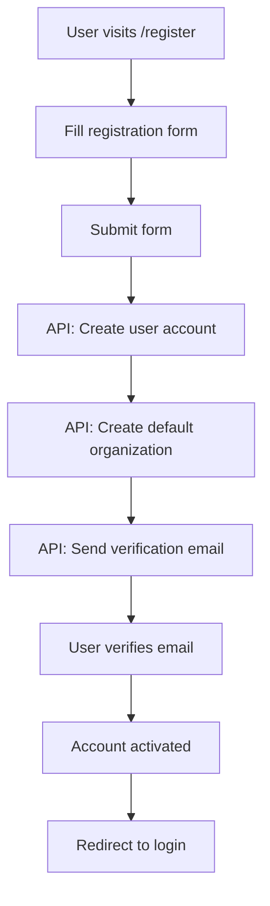

# Public Pages and Authentication Flow

## Overview

This document outlines the public-facing pages, authentication flow, and user onboarding process for the Monitoring Platform, including how users obtain API credentials for their Drupal sites.

## Public/Anonymous Pages

### 1. Landing Page (`/`)
The main public page that markets the platform and its features.

```typescript
// src/features/public/pages/LandingPage.tsx
interface LandingPageSections {
  hero: {
    title: string
    subtitle: string
    ctaButtons: {
      primary: "Start Free Trial"
      secondary: "View Demo"
    }
  }
  features: Feature[]
  pricing: PricingPlan[]
  security: SecurityHighlight[]
  testimonials: Testimonial[]
  faq: FAQ[]
}

const LandingPage = () => {
  return (
    <PublicLayout>
      <HeroSection />
      <FeaturesSection />
      <SecuritySection />
      <PricingSection />
      <TestimonialsSection />
      <FAQSection />
      <CTASection />
    </PublicLayout>
  )
}
```

### 2. Features Page (`/features`)
Detailed explanation of platform capabilities.

```typescript
interface PlatformFeatures {
  monitoring: {
    title: "Real-time Module Monitoring"
    description: "Track security updates across all your Drupal sites"
    capabilities: [
      "Automatic security update detection",
      "Module version tracking",
      "Vulnerability scanning",
      "Update history tracking"
    ]
  }
  reporting: {
    title: "Comprehensive Reporting"
    description: "Generate detailed security and compliance reports"
    capabilities: [
      "Monthly security summaries",
      "SLA compliance tracking",
      "Export to PDF/CSV",
      "Custom report scheduling"
    ]
  }
  integration: {
    title: "Easy Drupal Integration"
    description: "Simple setup with our Drupal module"
    capabilities: [
      "One-click module installation",
      "Automatic site discovery",
      "Secure API communication",
      "Multi-site support"
    ]
  }
}
```

### 3. Documentation (`/docs`)
Public documentation for integration and API usage.

```typescript
interface DocumentationStructure {
  gettingStarted: {
    quickStart: "/docs/quick-start"
    installation: "/docs/installation"
    configuration: "/docs/configuration"
  }
  integration: {
    drupalModule: "/docs/drupal-module"
    apiReference: "/docs/api-reference"
    webhooks: "/docs/webhooks"
  }
  guides: {
    authentication: "/docs/guides/authentication"
    siteSetup: "/docs/guides/site-setup"
    troubleshooting: "/docs/guides/troubleshooting"
  }
}
```

### 4. Pricing Page (`/pricing`)
Subscription tiers and pricing information.

```typescript
interface PricingPlan {
  name: "Starter" | "Professional" | "Enterprise"
  price: number
  period: "monthly" | "yearly"
  features: string[]
  limits: {
    sites: number
    users: number
    apiCalls: number
    reportExports: number
  }
  cta: string
}
```

### 5. Login/Register Pages (`/login`, `/register`)

```typescript
// src/features/auth/pages/LoginPage.tsx
const LoginPage = () => {
  const [login] = useLoginMutation()
  const navigate = useNavigate()
  
  const onSubmit = async (data: LoginFormData) => {
    try {
      const result = await login(data).unwrap()
      // Store token and redirect to dashboard
      dispatch(setCredentials(result))
      navigate('/dashboard')
    } catch (error) {
      toast.error('Invalid credentials')
    }
  }
  
  return (
    <PublicLayout minimal>
      <div className="auth-container">
        <h1>Sign In to Monitoring Platform</h1>
        <LoginForm onSubmit={onSubmit} />
        <p>
          Don't have an account? 
          <Link to="/register">Sign up for free</Link>
        </p>
      </div>
    </PublicLayout>
  )
}
```

## Authentication Flow

### 1. User Registration Flow



### 2. Login and Token Management

```typescript
// src/features/auth/authSlice.ts
interface AuthState {
  user: User | null
  token: string | null
  refreshToken: string | null
  isAuthenticated: boolean
  loading: boolean
}

const authSlice = createSlice({
  name: 'auth',
  initialState,
  reducers: {
    setCredentials: (state, action) => {
      const { user, access_token, refresh_token } = action.payload
      state.user = user
      state.token = access_token
      state.refreshToken = refresh_token
      state.isAuthenticated = true
    },
    logout: (state) => {
      state.user = null
      state.token = null
      state.refreshToken = null
      state.isAuthenticated = false
    },
  },
})

// Token refresh logic
const refreshToken = async () => {
  try {
    const response = await api.post('/auth/refresh', {
      refresh_token: store.getState().auth.refreshToken
    })
    store.dispatch(setCredentials(response.data))
  } catch (error) {
    store.dispatch(logout())
    window.location.href = '/login'
  }
}
```

## Post-Login Dashboard

### 1. Initial Setup Wizard
First-time users are guided through setup:

```typescript
interface SetupWizardSteps {
  organizationSetup: {
    title: "Set Up Your Organization"
    fields: ["organization_name", "website", "timezone"]
  }
  firstSite: {
    title: "Add Your First Drupal Site"
    fields: ["site_name", "site_url", "description"]
  }
  apiCredentials: {
    title: "Get Your API Credentials"
    actions: ["generate_api_key", "download_drupal_module"]
  }
  verification: {
    title: "Verify Connection"
    status: "waiting" | "connected" | "error"
  }
}

const SetupWizard = () => {
  const [currentStep, setCurrentStep] = useState(0)
  const [setupData, setSetupData] = useState<SetupData>({})
  
  return (
    <WizardContainer>
      <WizardProgress current={currentStep} total={4} />
      <WizardStep step={steps[currentStep]} />
      <WizardNavigation 
        onNext={() => setCurrentStep(prev => prev + 1)}
        onBack={() => setCurrentStep(prev => prev - 1)}
      />
    </WizardContainer>
  )
}
```

### 2. API Credentials Management

```typescript
// src/features/settings/pages/APICredentialsPage.tsx
const APICredentialsPage = () => {
  const { data: credentials } = useGetAPICredentialsQuery()
  const [generateKey] = useGenerateAPIKeyMutation()
  
  return (
    <SettingsLayout>
      <h1>API Credentials</h1>
      
      <section className="credentials-section">
        <h2>Site Authentication</h2>
        <p>Use these credentials to connect your Drupal sites</p>
        
        <div className="credential-box">
          <label>Site UUID</label>
          <div className="credential-value">
            <code>{credentials?.site_uuid}</code>
            <CopyButton value={credentials?.site_uuid} />
          </div>
        </div>
        
        <div className="credential-box">
          <label>API Key</label>
          <div className="credential-value">
            <code>{credentials?.api_key || '••••••••••••••••'}</code>
            <button onClick={generateKey}>Regenerate</button>
          </div>
          <p className="warning">
            ⚠️ Store this key securely. It won't be shown again.
          </p>
        </div>
        
        <div className="integration-guide">
          <h3>Integration Steps</h3>
          <ol>
            <li>Download the Drupal monitoring module</li>
            <li>Install and enable the module on your Drupal site</li>
            <li>Navigate to Configuration → Monitoring Settings</li>
            <li>Enter your Site UUID and API Key</li>
            <li>Test the connection</li>
          </ol>
          
          <button className="download-button">
            <Download /> Download Drupal Module
          </button>
        </div>
      </section>
      
      <section className="api-docs-section">
        <h2>Direct API Access</h2>
        <p>For advanced users and custom integrations</p>
        
        <CodeBlock language="bash">
          {`# Submit module data
curl -X POST https://api.monitoring.com/v1/sites/{site_uuid}/modules \\
  -H "Authorization: Bearer YOUR_API_KEY" \\
  -H "Content-Type: application/json" \\
  -d @modules.json`}
        </CodeBlock>
        
        <Link to="/docs/api-reference">
          View Full API Documentation →
        </Link>
      </section>
    </SettingsLayout>
  )
}
```

### 3. Organization Management

```typescript
// src/features/organizations/pages/OrganizationSettingsPage.tsx
const OrganizationSettingsPage = () => {
  const { data: org } = useGetOrganizationQuery()
  const [updateOrg] = useUpdateOrganizationMutation()
  
  return (
    <SettingsLayout>
      <Tabs defaultValue="general">
        <TabsList>
          <TabsTrigger value="general">General</TabsTrigger>
          <TabsTrigger value="members">Members</TabsTrigger>
          <TabsTrigger value="billing">Billing</TabsTrigger>
          <TabsTrigger value="security">Security</TabsTrigger>
        </TabsList>
        
        <TabsContent value="general">
          <OrganizationForm 
            organization={org}
            onSubmit={updateOrg}
          />
        </TabsContent>
        
        <TabsContent value="members">
          <TeamMembersManager 
            members={org?.users}
            onInvite={inviteMember}
            onRemove={removeMember}
            onUpdateRole={updateMemberRole}
          />
        </TabsContent>
        
        <TabsContent value="billing">
          <BillingSettings 
            subscription={org?.subscription}
            usage={org?.usage}
          />
        </TabsContent>
        
        <TabsContent value="security">
          <SecuritySettings 
            settings={org?.security_settings}
            onUpdate={updateSecuritySettings}
          />
        </TabsContent>
      </Tabs>
    </SettingsLayout>
  )
}
```

### 4. Site Management

```typescript
// src/features/sites/pages/SiteManagementPage.tsx
const SiteManagementPage = () => {
  const { data: sites } = useGetSitesQuery()
  const [showAddModal, setShowAddModal] = useState(false)
  
  return (
    <DashboardLayout>
      <PageHeader
        title="Sites"
        action={
          <button onClick={() => setShowAddModal(true)}>
            <Plus /> Add Site
          </button>
        }
      />
      
      <SitesList>
        {sites?.map(site => (
          <SiteCard key={site.id}>
            <SiteHeader>
              <h3>{site.name}</h3>
              <SiteStatus status={site.status} />
            </SiteHeader>
            
            <SiteMetrics>
              <Metric
                label="Modules"
                value={site.module_count}
              />
              <Metric
                label="Security Updates"
                value={site.security_updates}
                variant="danger"
              />
              <Metric
                label="Last Sync"
                value={formatDistance(site.last_sync)}
              />
            </SiteMetrics>
            
            <SiteActions>
              <Link to={`/sites/${site.id}`}>View Details</Link>
              <button onClick={() => syncSite(site.id)}>
                Sync Now
              </button>
              <Dropdown>
                <DropdownItem onClick={() => editSite(site)}>
                  Edit
                </DropdownItem>
                <DropdownItem onClick={() => viewCredentials(site)}>
                  API Credentials
                </DropdownItem>
                <DropdownItem 
                  onClick={() => deleteSite(site)} 
                  variant="danger"
                >
                  Delete
                </DropdownItem>
              </Dropdown>
            </SiteActions>
          </SiteCard>
        ))}
      </SitesList>
      
      {showAddModal && (
        <AddSiteModal
          onClose={() => setShowAddModal(false)}
          onSuccess={(site) => {
            setShowAddModal(false)
            showCredentialsModal(site)
          }}
        />
      )}
    </DashboardLayout>
  )
}
```

## User Profile Management

```typescript
// src/features/profile/pages/ProfilePage.tsx
const ProfilePage = () => {
  const { data: user } = useGetProfileQuery()
  const [updateProfile] = useUpdateProfileMutation()
  const [changePassword] = useChangePasswordMutation()
  
  return (
    <SettingsLayout>
      <h1>Profile Settings</h1>
      
      <section className="profile-section">
        <h2>Personal Information</h2>
        <ProfileForm
          user={user}
          onSubmit={updateProfile}
        />
      </section>
      
      <section className="security-section">
        <h2>Security</h2>
        <ChangePasswordForm
          onSubmit={changePassword}
        />
        
        <div className="two-factor-auth">
          <h3>Two-Factor Authentication</h3>
          <TwoFactorSetup 
            enabled={user?.two_factor_enabled}
            onEnable={enableTwoFactor}
            onDisable={disableTwoFactor}
          />
        </div>
        
        <div className="sessions">
          <h3>Active Sessions</h3>
          <SessionsList 
            sessions={user?.sessions}
            onRevoke={revokeSession}
          />
        </div>
      </section>
      
      <section className="notifications-section">
        <h2>Notification Preferences</h2>
        <NotificationSettings
          preferences={user?.notification_preferences}
          onUpdate={updateNotificationPreferences}
        />
      </section>
    </SettingsLayout>
  )
}
```

## Public Layout Component

```typescript
// src/components/layout/PublicLayout.tsx
interface PublicLayoutProps {
  children: React.ReactNode
  minimal?: boolean
}

const PublicLayout: React.FC<PublicLayoutProps> = ({ 
  children, 
  minimal = false 
}) => {
  return (
    <div className="min-h-screen bg-gray-50">
      {!minimal && <PublicHeader />}
      
      <main className="public-content">
        {children}
      </main>
      
      {!minimal && <PublicFooter />}
    </div>
  )
}

const PublicHeader = () => {
  return (
    <header className="bg-white shadow-sm">
      <nav className="container mx-auto px-4 py-4">
        <div className="flex items-center justify-between">
          <Logo />
          
          <div className="hidden md:flex items-center space-x-8">
            <NavLink to="/features">Features</NavLink>
            <NavLink to="/pricing">Pricing</NavLink>
            <NavLink to="/docs">Documentation</NavLink>
            <NavLink to="/about">About</NavLink>
          </div>
          
          <div className="flex items-center space-x-4">
            <Link to="/login" className="text-primary-600">
              Sign In
            </Link>
            <Link 
              to="/register" 
              className="btn btn-primary"
            >
              Get Started
            </Link>
          </div>
        </div>
      </nav>
    </header>
  )
}
```

## Route Configuration

```typescript
// src/routes/index.tsx
export const AppRoutes = () => {
  const { isAuthenticated } = useAppSelector(state => state.auth)
  
  return (
    <Routes>
      {/* Public routes */}
      <Route path="/" element={<LandingPage />} />
      <Route path="/features" element={<FeaturesPage />} />
      <Route path="/pricing" element={<PricingPage />} />
      <Route path="/docs/*" element={<DocumentationRoutes />} />
      <Route path="/login" element={<LoginPage />} />
      <Route path="/register" element={<RegisterPage />} />
      <Route path="/forgot-password" element={<ForgotPasswordPage />} />
      <Route path="/reset-password" element={<ResetPasswordPage />} />
      
      {/* Protected routes */}
      <Route element={<ProtectedRoute />}>
        <Route path="/dashboard" element={<DashboardPage />} />
        <Route path="/organizations" element={<OrganizationsPage />} />
        <Route path="/sites" element={<SitesPage />} />
        <Route path="/sites/:id" element={<SiteDetailPage />} />
        <Route path="/modules" element={<ModulesPage />} />
        <Route path="/reports" element={<ReportsPage />} />
        <Route path="/settings/*" element={<SettingsRoutes />} />
        <Route path="/profile" element={<ProfilePage />} />
      </Route>
      
      {/* 404 */}
      <Route path="*" element={<NotFoundPage />} />
    </Routes>
  )
}

const ProtectedRoute = () => {
  const { isAuthenticated, loading } = useAppSelector(state => state.auth)
  const location = useLocation()
  
  if (loading) return <LoadingScreen />
  
  if (!isAuthenticated) {
    return <Navigate to="/login" state={{ from: location }} replace />
  }
  
  return <Outlet />
}
```

## Key Features for Anonymous Users

1. **Marketing Content**: Clear value proposition and features
2. **Documentation**: Comprehensive guides without login
3. **Pricing Transparency**: Clear pricing and limits
4. **Demo Access**: Interactive demo or video walkthrough
5. **Trust Indicators**: Security badges, testimonials, case studies
6. **Easy Registration**: Simple sign-up process with email verification
7. **API Documentation**: Public API docs for evaluation

## Post-Login User Journey

1. **Onboarding Wizard**: Guide through initial setup
2. **Organization Creation**: Set up company/team structure
3. **Site Registration**: Add Drupal sites to monitor
4. **API Credentials**: Generate and manage API keys
5. **Drupal Module Setup**: Download and configuration instructions
6. **First Data Sync**: Verify connection and initial data
7. **Dashboard Customization**: Set up monitoring preferences

This comprehensive approach ensures users can:
- Understand the platform value before signing up
- Easily create accounts and get started
- Obtain necessary credentials for Drupal integration
- Manage their organizations and sites effectively
- Access all platform features post-authentication